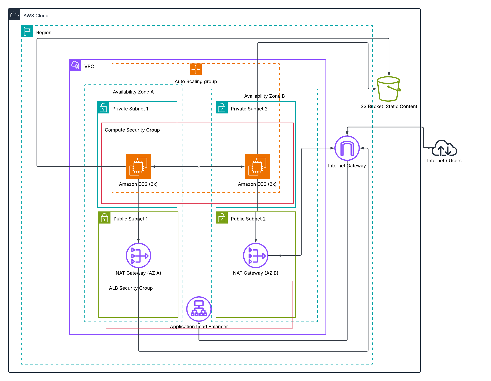

# CD12352 - Infrastructure as Code Project Solution
# JULIAN TRAPP

## Solution

### Link
 [Udagram](http://udagra-loadb-6n3ewtgku8bn-2007653544.us-east-1.elb.amazonaws.com/) 

### Screenshots
1) output sections from both CloudFormation stacks, clearly showing the date and time the stacks were deployed
    
    
2) successful access to the website via the Load Balancer URL
    

3) S3 bucket containing the static files
    

## Infrastructure Diagram

*Remark: simplifications have been made on the EC2 to S3 bucket route, as well as the assignement of the ALB to the public subnets.*

## Automation scripts
### Spin up instructions

Prerequisites: configure AWS CLI profile

Deploy the network stack first, then the application stack:

```bash
./run.sh --profile udagram deploy us-east-1 udagram-network network.yml network-parameters.json
```
```bash
./run.sh --profile udagram deploy us-east-1 udagram-application udagram.yml udagram-parameters.json
```
Then upload the static files to the S3 bucket. The cron job in the EC2 UserData script will fetch the S3 server every minute
```bash
aws s3 cp index.html s3://udagram-network-$(aws sts get-caller-identity --query Account --output text --profile udagram)-udagram-bucket/ --profile udagram
```

### Tear down instructions

Delete the application stack first. The script empties its S3 bucket automatically before deleting the stack. Delete the network stack afterward:

```bash
./run.sh delete us-east-1 udagram-application
```
```bash
./run.sh delete us-east-1 udagram-network
```

## UPDATE: Submission #2
In the first submission I did not pass because of the index.html creation in the UserData script without S3 pulling. This is changed now.

1) Change index.html in your workspace


2) Then upload the static files to the S3 bucket. The cron job in the EC2 UserData script will fetch the S3 server every minute
```bash
aws s3 cp index.html s3://udagram-network-$(aws sts get-caller-identity --query Account --output text --profile udagram)-udagram-bucket/ --profile udagram
```


For reference here is the new UserData script

    # Cronjob
    echo "* * * * * aws s3 sync s3://${EnvironmentName}-${AWS::AccountId}-udagram-bucket /var/www/html/ && chown -R www-data:www-data /var/www/html" | crontab -

    # Sync operation between EC2 and S3 instance
    aws s3 sync s3://${EnvironmentName}-${AWS::AccountId}-udagram-bucket /var/www/html/


### I hope you appreciate the full automation of this solution - network, application and now even static content update via code! :)