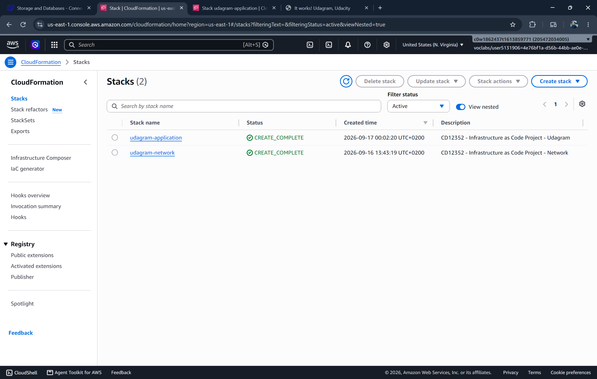

# CD12352 - Infrastructure as Code Project Solution
# JULIAN TRAPP

## Solution

### Link
 [Udagram](http://udagra-loadb-6n3ewtgku8bn-2007653544.us-east-1.elb.amazonaws.com/) 

### Screenshots
1) output sections from both CloudFormation stacks, clearly showing the date and time the stacks were deployed
    
    
    
2) successful access to the website via the Load Balancer URL
    

3) S3 bucket containing the static files
    

## Infrastructure Diagram

*Remark: simplifications have been made on the EC2 to S3 bucket route, as well as the assignement of the ALB to the public subnets.*

## Automation scripts
### Spin up instructions

Prerequisites: configure AWS CLI profile

Deploy the network stack first, then the application stack:

```bash
./run.sh --profile udagram deploy us-east-1 udagram-network network.yml network-parameters.json
./run.sh --profile udagram deploy us-east-1 udagram-application udagram.yml udagram-parameters.json
```

### Tear down instructions

Delete the application stack first. The script empties its S3 bucket automatically before deleting the stack. Delete the network stack afterward:

```bash
./run.sh delete us-east-1 udagram-application
./run.sh delete us-east-1 udagram-network
```